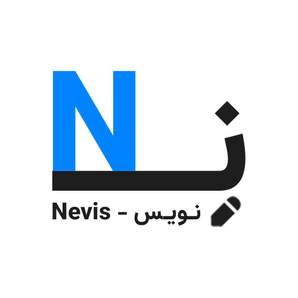

# 📌 CanGrow 2 -Nevis – AI Career Engine How To Run

<p align="center">
  
</p>

<p align="center">
  
</p>

## ✨ Description | Purpose Of The Project

**Nevis – AI Career Engine Development Repository** Is The Foundation Of The Nevis Project, Dedicated To The Raw Development Work For An AI-Powered Career Intelligence Platform. This Repository Houses The Data Preprocessing Scripts, Exploratory Data Analysis (EDA) Notebooks, Model Training, And Feature Extraction Logic Necessary To Build The Core Machine Learning And NLP Pipelines. It Is Designed For Developers And Data Scientists Who Aim To Understand, Extend, Or Replicate The Underlying Technology Of Nevis. The Main Objective Is To Preprocess Resumes, Train Classification Models For Job Matching, Analyze Skill Gaps, And Prepare Artifacts (Like Trained Models And Processed Datasets) For Deployment In The Final Product Repository.

---

## 🎯 Purpose Of This Guide
This Guide Helps You Deploy And Run The Nevis AI-Powered Resume Analyzer Locally Using Docker, Ensuring Smooth Setup And Access To The Streamlit UI. 🖥️

## 🧠 Key Steps Covered
- **Docker Deployment** 🐳: Build And Run The App Using Docker And Docker Compose.
- **Port Access** 🌐: Access The Streamlit UI At [http://localhost:8501](http://localhost:8501).
- **Model Mounting** 📂: Ensure Model Files Are Available In The Container.
- **Troubleshooting** 🔧: Resolve Common Setup Issues.

---

## 🧰 Tech Stack For Deployment

| Category           | Tool/Library       | Version   | Purpose                     |
|--------------------|--------------------|-----------|-----------------------------|
| Base Image         | Python            | 3.10-slim | Container Base Image        |
| Web Framework      | Streamlit         | 1.39.0    | UI Development              |
| Orchestration      | Docker Compose    | 3.8       | Container Management        |
| Model Access       | Volume Mounting   | -         | Persistent Model Files      |

## 🏗️ Project Structure

```bash
CanGrow2-Final/
├── App/
│   ├── StreamlitApp.py
│   ├── Model.py
│   ├──Assets/
│   │   └── Models/
│   │       ├── Model.pkl
│   │       ├── Vectorizer.pkl
│   │       └── Metadata.json
│   └── Statics/
│       ├── Nevis-Introduction.mp4
│       ├── Nevis-IntroVideo.mp4
│       ├── Nevis-Logo.png
│       ├── Nevis-LogoMotion.gif
│       ├── Nevis-LogoMotion.mp4
│       └── Nevis-Logo-White-Bg.jpg
├── Docs/
│   ├── HowToRun.md
│   ├── Tutorial.md
│   └── Documents/
│       ├── Nevis-ArchitectureNotes.pdf
│       ├── Nevis-ModelNotes.pdf
│       ├── Project-Checklist.pdf
│       └── TechnicalFlowchart.pdf
├── DockerCompose.yml
├── Dockerfile
├── README.md
├── Requirements.txt
```
---

## ⚙️ Steps To Run The Application

### 1. Prerequisites 📦
Get Your System Ready For Deployment !

- Install **Docker** And **Docker Compose** On Your System.  
- Ensure **Tesseract-OCR** Is Installed For OCR Support :  
  - **Windows**: Install From [Tesseract OCR](https://github.com/tesseract-ocr/tesseract).  
  - **Linux**: Run `sudo apt-get install tesseract-ocr`.

### 2. Clone The Repository 🧬

```bash
git clone https://github.com/ItzSqleh/CanGrow2-Final.git
cd CanGrow2-Final
```

### 3. Build And Run Using Docker Compose 🐳
The Docker Compose File Is Named **DockerCompose.yml**, So Specify It Explicitly :

```bash
docker-compose -f DockerCompose.yml up --build
```
This Builds The Docker Image And Starts The Container. 🚢

### 4. Access The Application 🌐
Once The Container Is Running, Access The Streamlit UI At :  
[http://localhost:8501](http://localhost:8501)  
The UI Provides Options To Upload Resumes, View Analysis, And Use The Chatbot. 🎉


## 🚀 Troubleshooting Tips
Run Into Issues? Here Are Quick Fixes! 🔧  
- **Port Conflict** ⚠️: If Port 8501 Is In Use, Update The Port Mapping In **DockerCompose.yml** (e.g., `"8502:8501"`).  
- **Model Files Missing** 📂: Verify That **App/Assets/Models** Contains **Model.pkl**, **Vectorizer.pkl**, And **Metadata.json**.  
- **Tesseract Error** 🔍: Ensure **Tesseract-OCR** Is Installed And Accessible In The Container.  
- **Container Logs** 📜: Check Logs For Errors With `docker-compose -f DockerCompose.yml logs`.

---

## ⏰ Last Updated
**Date**: May 31, 2025 🕘

Get Started With Nevis And Unlock Your Career Potential ! 🌟 Happy Analyzing ! 🌱