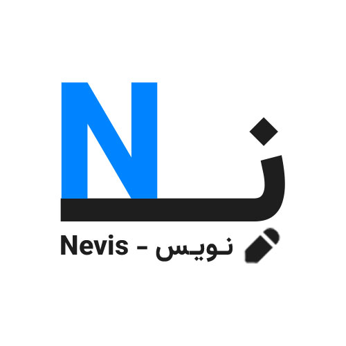

# 📌 CanGrow2 – Nevis – Smart Career Path Navigator & Self-Growth Assistant 🌱

<p align="center">
  
  
  
</p>

<p align="center">
  
</p>

<p align="center">
  <video width="600" controls>  
    <source src="App/Statics/Nevis-IntroVideo.mp4" type="video/mp4">  
    Your Browser Does Not Support The Video Tag !  
  </video>
</p>

## ✨ About The Project

🌟 **Nevis – Smart Career Path Navigator & Self-Growth Assistant** Is An Innovative AI-Powered Platform Designed To Empower Professionals And Job Seekers With Actionable Career Insights. Built As Part Of The CanGrow2 Initiative, Nevis Enables Users To :  

- 📄 Upload Resumes In Diverse Formats (`.txt`, `.pdf`, `.docx`, `.jpg`, `.png`).  
- 🔍 Receive AI-Generated Job Recommendations And Skill Gap Analysis.  
- 💡 Interact With A Chatbot For Personalized Career Guidance.  
- 🎯 Explore Tailored Development Roadmaps For Career Growth.  

Leveraging Advanced Machine Learning And NLP Techniques From The [CanGrow2-Raw-Nevis](https://github.com/ItzSqleh/CanGrow2-Raw-Nevis) Repository, Nevis Is Deployed Via Docker For Seamless Local Use, Accessible At [http://localhost:8501](http://localhost:8501). This Repository (`CanGrow2-Final`) Hosts The Final Application, Integrating Trained Models And A User-Friendly Streamlit Interface.

---

## 🧠 Key Features

| Feature                  | Description                                      |
|--------------------------|--------------------------------------------------|
| **Multi-Format Parsing** | Extracts Text From `.txt`, `.pdf`, Images Using OCR |
| **AI Job Matching**      | Suggests Top Job Roles With Confidence Scores    |
| **Skill Gap Analyzer**   | Identifies Missing Skills For Target Careers     |
| **Career Roadmaps**      | Provides Step-By-Step Progression Plans          |
| **Interactive Charts**   | Visualizes Job Probabilities And Skill Gaps      |
| **Chatbot Assistance**   | Offers Real-Time Answers To Career Queries       |
| **Dockerized Setup**     | One-Click Deployment With Persistent Model Access|

---

## 🏗️ Repository Structure

```bash
CanGrow2-Final/
├── App/
│   ├── StreamlitApp.py         # Main Streamlit UI Script
│   ├── Model.py                # Core Model Logic And Predictions
│   ├── Assets/                 # Static Assets And Models
│   │   └── Models/
│   │       ├── JobClassifier.pkl  # Trained Job Classifier Model (Includes Model and Vectorizer)
│   │       ├── ProcessedResumesWithSkills.csv # Output File
│   │       └── Skills.json # Output File
│   └── Statics/                # Multimedia And Branding Files
│       ├── Nevis-Introduction.mp4
│       ├── Nevis-IntroVideo.mp4
│       ├── Nevis-Logo.png
│       ├── Nevis-LogoMotion.gif
│       ├── Nevis-LogoMotion.mp4
│       └── Nevis-Logo-White-Bg.jpg
├── Docs/                       # Documentation Files
│   ├── HowToRun.md             # Deployment Guide
│   ├── Tutorial.md             # User Tutorial
│   └── Documents/
│       ├── Nevis-ArchitectureNotes.pdf
│       ├── Nevis-ModelNotes.pdf
│       ├── Project-Checklist.pdf
│       └── TechnicalFlowchart.pdf
├── DockerCompose.yml           # Docker Compose Configuration
├── Dockerfile                  # Docker Image Build Instructions
├── README.md                   # Project Overview
├── Requirements.txt            # Python Dependencies
```

---

## 🛠️ Tech Stack

| Category           | Tool/Library      | Version  | Purpose                        |
|--------------------|-------------------|----------|-------------------------------|
| Base Image         | Python            | 3.10-slim| Container Base Image          |
| Machine Learning   | Scikit-learn      | 1.5.2    | Job Classification Models     |
| Text Processing    | NLTK              | 3.9.1    | NLP Feature Extraction        |
| Advanced NLP       | Transformers      | 4.45.1   | MBTI Detection And Summarization |
| Data Manipulation  | Pandas            | 2.2.3    | Data Handling                 |
| Numerical Ops      | NumPy             | 2.1.1    | Matrix Calculations           |
| Model Serialization| Joblib            | 1.4.2    | Model Persistence             |
| Visualization      | Matplotlib        | 3.9.2    | Plotting                      |
| Enhanced Viz       | Seaborn           | 0.13.2   | Statistical Visuals           |
| Interactive Charts | Plotly            | 5.23.0   | Dynamic Charts                |
| PDF Processing     | PyMuPDF           | 1.24.10  | Resume Extraction             |
| OCR                | Pytesseract       | 0.3.13   | Image Text Recognition        |
| Image Processing   | Pillow            | 10.4.0   | File Processing               |
| Progress Tracking  | Tqdm              | 4.66.5   | Progress Bars                 |
| Web Framework      | Streamlit         | 1.39.0   | Interactive UI                |
| HTTP Requests      | Requests          | 2.32.3   | API Calls                     |
| DOCX Processing    | Python-Docx       | 1.1.2    | DOCX Resume Parsing           |
| Fuzzy Matching     | FuzzyWuzzy        | 0.18.0   | MBTI Inference                |
| Containerization   | Docker Compose    | 3.8      | Orchestration                 |

---

## ⚙️ Core Workflows

### 1. Resume Processing Pipeline 🌱

**Input**: Resume Files (`.txt`, `.pdf`, `.docx`, Images).  
**Steps**:  
- 📥 File Upload And Text Extraction (OCR For Images).  
- 🧹 NLP Cleaning (Tokenization, Lemmatization, Stopword Removal).  
- 📊 Feature Generation (Skills, MBTI, Text Vectors).  
**Output**: Processed Resume Data For Analysis.

### 2. Job Recommendation Engine 🔥

**Process**:  
- 📈 TF-IDF Vectorization Of Resume Text.  
- 🤖 Model Inference With Logistic Regression.  
- ⭐ Top-3 Job Suggestions With Probabilities.  
**Output**: Ranked Job List With Career Paths.

### 3. Skill Gap Analysis 🛠️

**Process**:  
- 🔍 Extract Current Skills From Resume.  
- 📋 Compare With Job Requirements.  
- 📝 Generate Missing Skills Report.  
**Output**: Skill Gap Matrix And Development Suggestions.

### 4. Interactive Chatbot 💬

**Process**:  
- 🎙️ User Query Input (e.g., "What Jobs For Me?").  
- 🧠 AI Response Generation Via Grok API.  
- 📤 Real-Time Feedback On Jobs, Skills, And MBTI.  
**Output**: Personalized Career Advice.

---

## 🚀 Deployment Instructions

### Prerequisites ✅
- Python 3.10+ (For Local Testing).  
- Docker And Docker Compose Installed.
- Tesseract-OCR For OCR Support:  
  - **Windows**: Install From [Tesseract OCR](https://github.com/tesseract-ocr/tesseract).
  - **Ubuntu**:
  ```bash
  sudo apt update
  sudo apt install tesseract-ocr
  ```
Add The Installation Path (E.g., C:\Program Files\Tesseract-Ocr\Tesseract.Exe) To The Environment Variable Path Or Configure It In The Code:

- **Windows**:
  ```bash
  setx PATH "%PATH%;C:\Program Files\Tesseract-OCR"
  ```

### Local Setup (Without Docker) 🖥️
1. Clone The Repository:  
   ```bash
   git clone https://github.com/ItzSqleh/CanGrow2-Final.git

   cd CanGrow2-Final
   ```
2. Create A Virtual Environment:  
   ```bash
   python -m venv NevisEnv

   source NevisEnv/bin/activate  # Windows: NevisEnv\Scripts\activate
   ```
3. Install Dependencies:  
   ```bash
   pip install -r Requirements.txt
   ```
   Or Use Pip :
   
   ```bash
   pip install \
    Pandas==2.2.3 \
    Numpy==2.1.1 \
    Scikit-Learn==1.5.2 \
    Joblib==1.4.2 \
    Nltk==3.9.1 \
    Wordcloud==1.9.3 \
    Matplotlib==3.9.2 \
    Seaborn==0.13.2 \
    Plotly==5.23.0 \
    Pymupdf==1.24.10 \
    Pytesseract==0.3.13 \
    Pillow==10.4.0 \
    Tqdm==4.66.5 \
    Transformers==4.45.1 \
    Streamlit==1.39.0 \
    Requests==2.32.3 \
    Python-Docx==1.1.2 \
    Fuzzywuzzy==0.18.0 \
    Python-Levenshtein
   ```
4. Download Nltk Data
Required Nltk Data Must Be Downloaded. This Can Be Done Automatically In The Code, But For Assurance, You Can Execute The Following Command:

```bash
python3 -c "import nltk; nltk.download(['punkt', 'stopwords', 'wordnet', 'punkt_tab'], quiet=True)"
```

5. Run The Streamlit App:  
   ```bash
   streamlit run App/StreamlitApp.py
   ```
6. Access At: [http://localhost:8501](http://localhost:8501).

### Docker Deployment (Recommended) 🐳
1. Clone The Repository:  
   ```bash
   git clone https://github.com/ItzSqleh/CanGrow2-Final.git

   cd CanGrow2-Final
   ```
2. Build And Run With Docker Compose (Note: File Is `DockerCompose.yml`):  
   ```bash
   docker-compose -f DockerCompose.yml up --build
   ```
3. Access The UI:  
   Open [http://localhost:8501](http://localhost:8501) In Your Browser.

---

## 📊 Expected Outputs
- **Job Recommendations** 🌟: A Ranked List With Confidence Scores (e.g., "Developer - 85%").  
- **Skill Reports** 📋: Matrix Of Existing And Missing Skills.  
- **Career Pathways** 🛤️: Timeline-Based Plans (e.g., Junior → Senior Roles).  
- **Chat Transcripts** 💬: Personalized Q&A Logs For Career Guidance.

🎥 **Watch The Demo**: [Nevis Intro Video](App/Statics/Nevis-IntroVideo.mp4)

---

## 📚 Additional Resources
- **Architecture Notes**: `Nevis-ArchitectureNotes.pdf`  
- **Model Details**: `Nevis-ModelNotes.pdf`  
- **Project Checklist**: `Project-Checklist.pdf`  
- **Technical Flowchart**: `TechnicalFlowchart.pdf`

**⚠️ Important Notice:** All Output Files (`ProcessedResumesWithSkills.csv`, `Skills.json`) Are Saved In The (`App\Assets\Models\`).

---

## ⏰ Last Updated
**Date**: May 31, 2025 🕘
